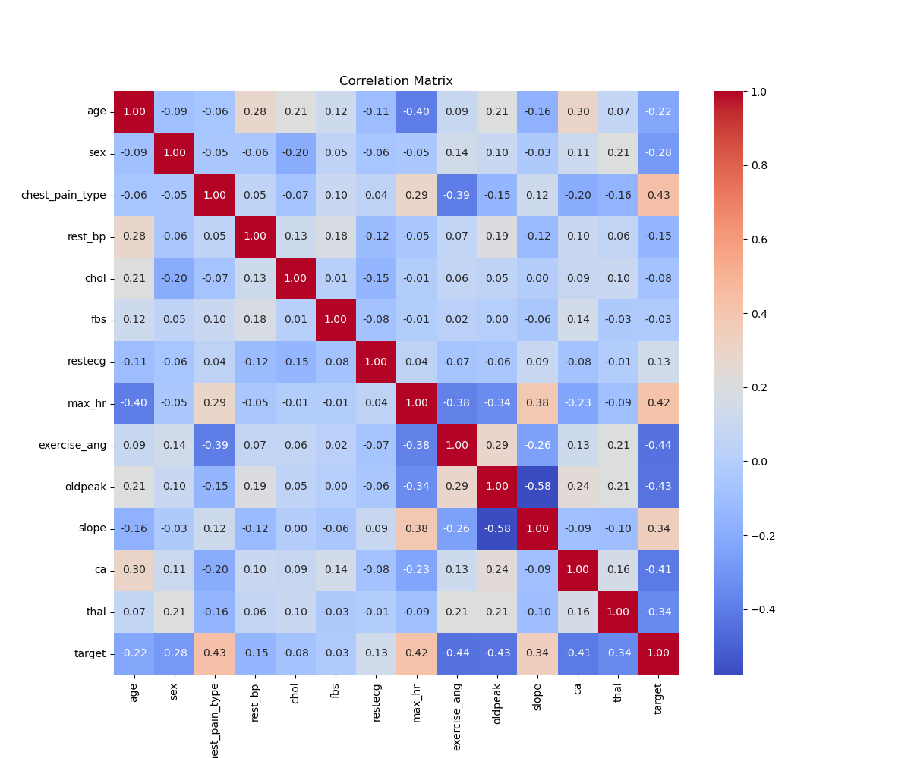

## Capstone Two - Final Project Report

## Problem Statement

To this day, heart disease remains the leading cause of death in the United States of America. One of the best ways to help reduce the number of heart disease related deaths each year is to develop better screening methods and improve early detection of the disease so that healthcare providers can take steps to improve health outcomes as early as possible. Advanced detection methods could really change how we handle heart disease. By catching issues earlier, these methods can not only help people get better care but also ease the strain on our healthcare systems by avoiding expensive treatments down the line. Therefore, allocating resources into these detection technologies could make a big difference in both patient experiences and overall healthcare costs. In my project, I hope to develop a model that can help accurate predict whether or not a patient will develop heart disease based several health metrics.

## 1. Data

The dataset used for this project is sourced from [Kaggle's Heart Disease UCI Dataset](https://www.kaggle.com/datasets/andrewmvd/heart-disease-data). It includes various medical features such as age, sex, cholesterol levels, and blood pressure. To view the dataset or download it, click the links below:

> * [Kaggle Dataset](https://www.kaggle.com/datasets/andrewmvd/heart-disease-data)

## 2. Method

For predicting heart disease, various machine learning algorithms can be employed:

1. **Logistic Regression:** A straightforward and interpretable algorithm useful for binary classification problems like heart disease prediction.

2. **Decision Trees:** A model that makes decisions based on the features of the data and can be visualized as a tree-like structure.

3. **Random Forest:** An ensemble method that combines multiple decision trees to improve prediction accuracy.

4. **Support Vector Machines (SVM):** A powerful classification algorithm that works well for complex but smaller datasets.

5. **Gradient Boosting Machines (GBM):** An ensemble technique that builds models sequentially to correct errors made by previous models.

**WINNER: Random Forest Classifier**

The Random Forest Classifier was chosen due to its high accuracy, robustness to overfitting, and ability to handle large datasets with numerous features.

## 3. Data Cleaning

[Data Cleaning Report](https://github.com/enapier64/Heart_Disease_Prediction/blob/c634fe6e759d33c3d3da0128fe466df902685e70/Heart_Disease_Data_Wrangling.ipynb)

In the data preparation process, the primary tasks were to load, clean, and preprocess the dataset to ensure its quality and usability for analysis.
> Initial Data Handling: The dataset heart.csv was imported and columns were renamed for clarity. The DataFrame was then examined to understand its structure and contents, including column names, shape, and a preview of the first few rows.
> Check Missing Values: Missing values are checked and displayed for each column.
> Identify and Handle Duplicates: Duplicate rows are identified, counted, and displayed. Only the first instance of each duplicate is shown, and all duplicates are removed.
> Save Cleaned Data: The cleaned DataFrame (with duplicates removed) is saved as a new CSV file at a specified path.

## 4. EDA

[EDA Report](https://github.com/enapier64/Program/blob/48d0649befce50f86d447fabeffeab07163aec4e/EDA_Working.ipynb)

Exploratory Data Analysis (EDA) revealed strong associations between heart disease and variables such as chest pain type, exercise-induced angina, and the number of major vessels colored, with chi-square and Fisher's exact tests showing very low p-values. Additionally, correlations indicated significant relationships between maximum heart rate and old peak depression with heart disease, underscoring their potential as important predictors

## 5. Algorithms & Machine Learning

[Preprocessing and Training](https://github.com/enapier64/Heart_Disease_Prediction/blob/c634fe6e759d33c3d3da0128fe466df902685e70/Pre-Processing%20and%20Training.ipynb)

Standardizing the data boosted performance, with the Random Forest classifier hitting 83.6% accuracy versus 80.3% for logistic regression. The Random Forest also showed better precision and recall, particularly for the target class, making it a stronger model overall.

## 6. Model Evaluation

[Modeling](https://github.com/enapier64/Program/blob/48d0649befce50f86d447fabeffeab07163aec4e/Modeling%20GCS2.ipynb)

The Random Forest model outperformed others with an accuracy of 83.6%, showing the best balance of precision and recall. Logistic Regression and Gradient Boosting both achieved 80.3% accuracy, with Random Forest consistently leading in cross-validation scores and feature importance rankings. Highest importance features were found to be: max_hr, chest_pain_type, oldpeak, thal, and ca

## 8. Future Improvements

* **Notebook Development:** Create an interactive notebook where users can input their health metrics and receive a personalized risk factor assessment based on the model's predictions.
* **Enhanced Hyperparameter Tuning:** Implement advanced hyperparameter tuning techniques to further refine the model and boost its accuracy.
* **Future Dataset Integration:** Explore and integrate additional datasets to leverage a broader range of categorical and numerical features, aiming to develop more robust and comprehensive models.

## 9. Credits

First and foremost, I'd like to give huge thanks to Wayne Ang who provided valuable guidance throughout this project! Additionally, I would like to the contributors of the Kaggle dataset, the authors of the machine learning libraries used, and the many healthcare workers striving to improve the lives of those around them daily.
